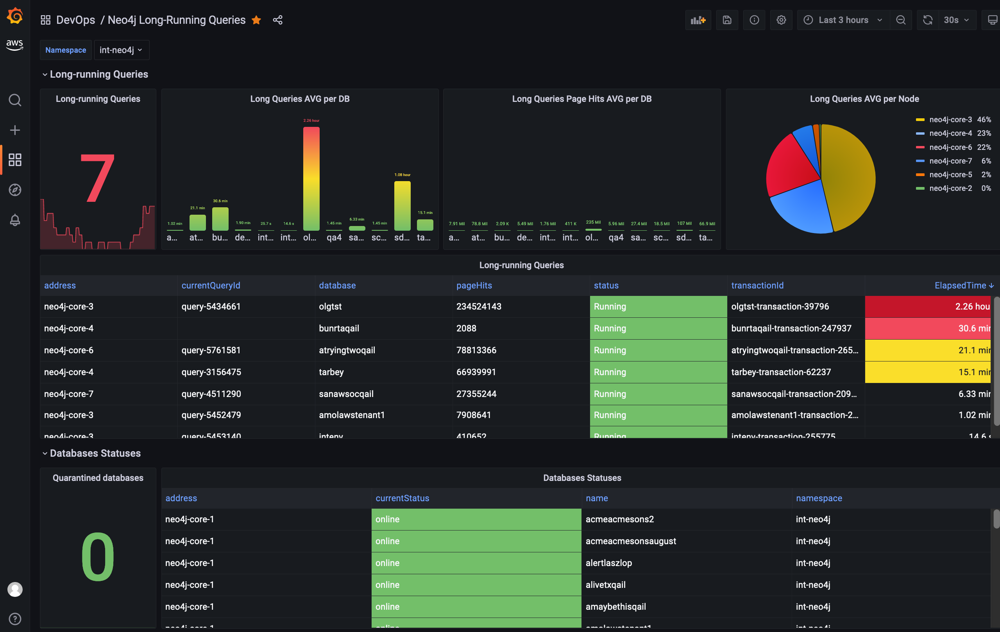

# Prometheus Neo4j Exporter
A Prometheus exporter for Neo4j including long-running queries and database statuses.

# Grafana Dashboard for Prometheus Neo4j Exporter

To import the Grafana dashboard:

1. Copy dashboard JSON text from: [neo4j-long-running-queries.json](grafana-dashboard/neo4j-long-running-queries.json) 
2. On the create tab, select Import.
3. Paste dashboard JSON text directly into the text area and click Load.
4. Select the Data Source as Prometheus and click Import.

